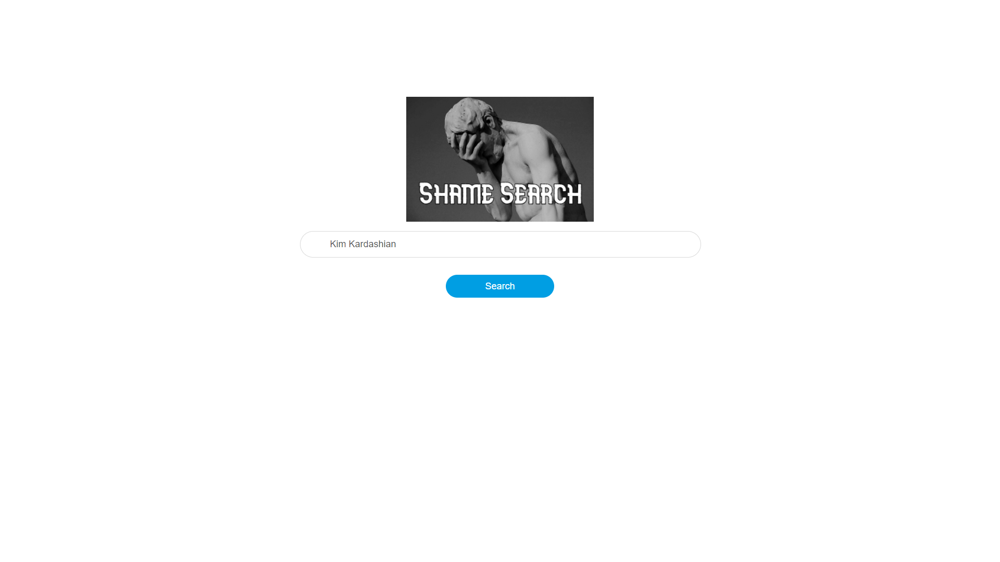
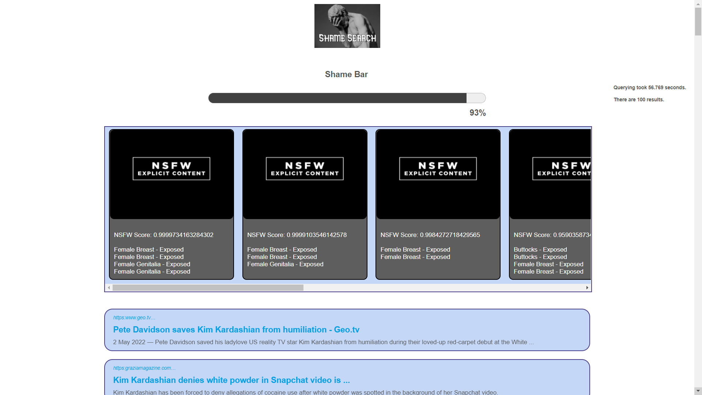

 
 

# Embarrassment Search Engine

This project is built in order to create a meta-search engine that finds potentially "embarrassing" personal material
(photos, text, etc) by mining various sources such as search engines, social network
sites, etc. We hope that this would play a role as an educational service by highlighting the
dangers of posting private information on the Web.

<!-- TABLE OF CONTENTS -->

  
Table of Contents

  <ol>
    <li><a href="#embarrassment-search-engine">Embarrassment Search Engine</a></li>
    <li><a href="#project-description">Project Description</a></li>
    <li><a href="#team-members">Team Members</a></li>
    <li><a href="#system-usage">System Usage</a></li>
    <li><a href="#technologies-used">Technologies Used</a></li>
  </ol>

## Project Description

    Unfortunately most people have posted explicit content before and lots of people still do. But they forget that data
on the Web is never actually lost. For example:

    Since social media is too common, people share pictures on a daily basis. These pictures often inclue other people 
as well. But the downside is that some of these pictures contain revealing content. In both cases, aforementioned 
pictures might be embarrassing.

    Also, text messages that are sent on social media platforms can be embarrasing as well.

    We want to highlight the dangers of these kind of actions. 

## Team Members

<table>
  <tr>
    <td align="center"><a href="https://github.com/hasanaliozkan-dev"> <b>Hasan Ali ÖZKAN</b></a>  <b>Full-Stack Developer</b></a> </a></td>
    <td align="center"><a href="https://github.com/mehmetkadri"> <b>Mehmet Kadri GOFRALILAR</b></a>  <b>Full-Stack Developer</b></a> </a></td>
  </tr>
</table>

## System Usage

  All you have to do is to type in the name of the person you want to search into searchbar.

  After this step, you will be seing a shame bar that will show the estimated shame level based
on resulting queries. Also potentially explicit pictures will be displayed, including the pictures'
level of nudity and exposed parts.

  Also potentially embarrassing query results will be displayed under the pictures.

 
 

## Technologies Used

 

<table>
    <tr>
        <td><b>Front End</b></td>
        <td style="width: 70px"></td>
        <td style="width: 70px"></td>
        <td style="width: 70px"></td>
    </tr>
    <tr>
        <td><b>Back End</b></td>
        <td></td>
        <td></td>
        <td></td>
    </tr>
</table>